# Facial Expression Recognition Challenge


## პროექტის მიმოხილვა

https://www.kaggle.com/competitions/challenges-in-representation-learning-facial-expression-recognition-challenge

ამ პროექტის მიზანი არის, რომ მოდელმა შეხედოს ადამიანის სახის 48x48 ფოტოს და დააფრედიქთოს 7 ემოციიდან რომელია ნაჩვენები.

მონაცემები მოიცავს 35887 ფოტოს, 28709-ს ტრენინგისთვის, 3589-ს ვალიდაციისთვის და 3589-ს ტესტისთვის.

მეტრიკა არის accuracy.

## მიდგომა

ჩემი მიდგომა იყო, რომ დამეწყო უმარტივესი მოდელით და დამემატებინა კომპლექსურობა ნელ-ნელა, წინა ექსპერიმენტების შედეგების გათვალისწინებით. გავტესტე 5 სხვადასხვა არქიტექტურა, გავუშვი დაახლოებით 55 ექსპერიმენტი და ყველაფერი დავლოგე WandB-ზე.

---

## რეპოზიტორიის სტრუქტურა

```
ml_assignment_4/
├── eda.ipynb                        - მონაცემთა ანალიზი
├── model_experiment_MLP.ipynb       - Multi Layer Perceptron
├── model_experiment_SimpleCNN.ipynb - მარტივი CNN
├── model_experiment_DeepCNN.ipynb   - Deep CNN რეზიდუალებით
├── model_experiment_ResNet.ipynb    - ResNet 
├── model_experiment_GoogLeNet.ipynb - GoogLeNet
├── model_inference.ipynb            - საბოლოო მოდელი
├── submission.csv         
├── images/                          - ჩარტები
└── README.md
```

---

## EDA

სანამ ტრენინგს დავიწყებდი, მონაცემები გამოვიკვლიე საფუძვლიანად.


### კატეგორიების განაწილება


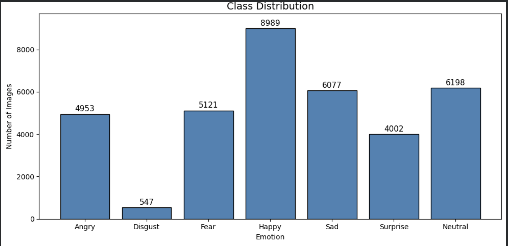

პირველ რიგში რაც შევამჩნიე იყო სერიოზული დისბალანსი. 8989 სურათი იყო Happy, ხოლო Disgust მხოლოდ 547. ეს სერიოზული პრობლემაა, რადგან ტრენინგის დროს მოდელი Happy სახეს 16-ჯერ უფრო ხშირად ხედავს ვიდრე Disgust-ს, ამიტომ ის ბუნებრივად უფრო ძლიერი ხდება Happy-ს ამოცნობაში. 

ამ დაკვირვების შემდეგ, პროექტის კეთების განმავლობაში, შედეგებს შესაბამისად ვუყურებდი. მაგალითად, თუ მოდელი მთლიანობაში მიაღწევდა 65% accuracy-ს, ყოველთვის ვამოწმებდი ცალკე კატეგორიების პერფორმანსს, რომ მენახა მართლა კარგი იყო თუ უბრალოდ მარტივ კატეგორიებს სწორად იცნობდა და რთულებს აიგნორებდა.

მონაცემები უკვე გაყოფილია csv ფაილში Usage სვეტის გამოყენებით, ამიტომ პირდაპირ ის გამოვიყენე.

### სურათები

მას შემდეგ რაც ნამდვილ სურათბს შევხედე, ახალი გამოწვევა გაჩნდა. ზოგი ემოცია ვიზუალურად ძალიან მსგავსია 48x48 სურათზე. შიშის და გაოცების შემთხვევაში აშკარად იყო ფართო თვალები. სევდა და სიბრაზე მოიცავდა ასევე მსგავს პატერნებს. ეს ნიშნავს, რომ ძალიან ძლიერმა მოდელმაც შეიძლება ამეებზე შეცდომები დაუშვას, რაც პრობლემაა.


## Forward და Backward შემოწმება

ყველა ნოუთბუქი იწყება 2 შემოწმებით სანამ ტრენინგი დაიწყება.

რენდომ ინიციალიზაციის მოდელის მოსალოდნელი საწყისი loss არის log(7) (7 კლასია). ეს შევამოწმე ყველა ნოუთბუქში მოდელის ერთხელ გარანვით ტრენინგამდე. ყველა შემთხვევაში საწყისი loss იყო ძალიან ახლოს 1.95-თან, რამაც დამიდასტურა, რომ მოდელი და loss ფუნქცია სწორად იყო დაიმპლემენტირებული.

ასევე ავიღე 10 ტრენინგ სურათი და დავატრენინგე მხოლოდ ამათზე (200 ნაბიჯში). სწორმა მოდელმა უნდა დაიზეპიროს 10 ნიმუში და loss 0-მდე ჩამოიყვანოს. ყველა შემთხვევაში ასე იყო. ეს ტესტი რომ დაფეილებულიყო, ეს მიმანიშნებდა, რომ რაღაც ფუნდამენტურად იყო დარღვეული არქიტექტურაში.


---

## 1. MLP (model_experiment_MLP.ipynb)

პროექტი დავიწყე Multi-layer perceptron-ით, იგივე fully connected network-ით, რადგან ეს იყო ყველაზე მარტივი ნეირინული ქსელი და კარგ baseline-ად გამოვიყენე. ყველა სურათი არის გადაქცეული 48x48-დან ერთ 2304 რიცხვიან ვექტორად და მიცემულია სტანდარტულ fully connected layer-ისთვის. ეს ყველა პიქსელს ექცევა, როგორც დამოუკიდებეულ feature-ს.


### ექსპერიმენტები და შედეგები

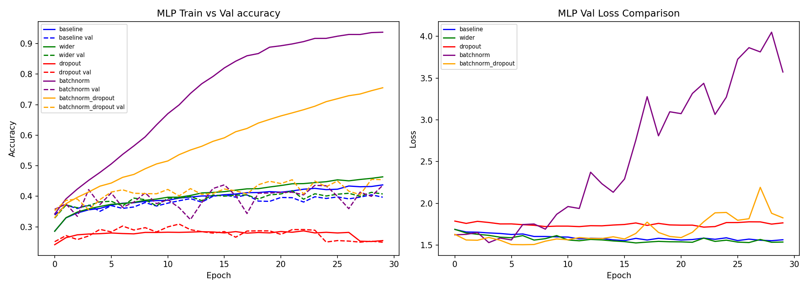

**Run 1: MLP Baseline (512 hidden ნეირონი, Adam, lr=0.001):**

Train accuracy: 43.7%, Val accuracy: 39.7%. 

train და val ახლოს არიან ერთმანეთთან, რაც როგორც წესი ნიშნავს, რომ მოდელი კარგად არის რეგულირებული. მაგრამ აქ ორივე ხაზი უბრალოდ დაბალზეა. მოდელი ანდერიფტშია, რადგან სივრცითი პატერნების სწავლა არ შეუძლია.

**Run 2: MLP Wider:**

Train: 46.4%, Val: 40.8%. 

მეტი ნეირონის დამატება მოდელს დაეხმარა ცოტათი, მაგრამ val თითქმის არ შეცვლილა. train და val უფრო დაშორდნენ ერთმანეთს, რაც ოვერფიტის დაწყების ნიშანია. უბრალოდ მეტი პარამეტრი, უკეთესი არქიტექტურის გარეშე, იწვევს დაზეპირებას.

**Run 3: MLP Dropout 0.5:**

Train: 25.2%, Val: 25.0%.

0.5 დროფაუთი რენდომად აუქმებს ნეირონების ნახევარს თითოეულ ნაბიჯზე. იმ მოდელისთვის, რომელიც ისედაც ვერ იღებდა ინფორმაციას flattened სურათისგან, ეს ძალიან აგრესიული აღმოჩნდა და საერთოდ ვერაფერი ისწავლა.

**ოპტიმაიზერების შედარება:**

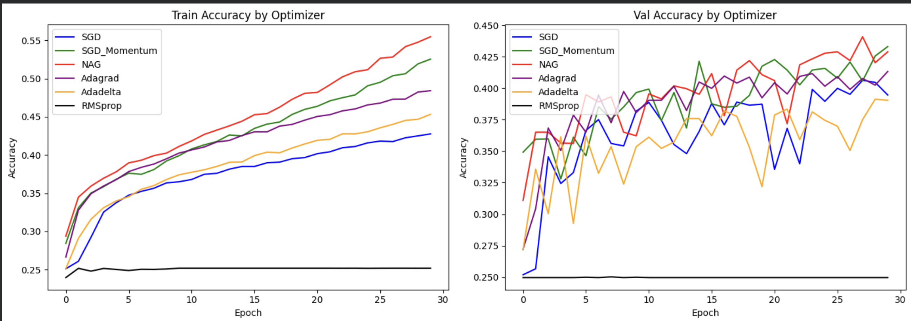

| ოპტიმაიზერი | Train Acc | Val Acc |
|---|---|---|
| SGD | 42.8% | 39.5% |
| SGD + Momentum | 52.5% | 43.3% |
| NAG (Nesterov) | 55.5% | 42.9% |
| Adagrad | 48.4% | 41.3% |
| Adadelta | 45.3% | 39.0% |
| RMSprop | 25.2% | 25.0% |
| Adam | 43.7% | 39.7% |


ყველაზე მნიშვნლოვანი აღმოჩენა აქედან არის, რომ RMSprop, lr=0.01-ით სრულიად დაფეილდა, გაიჭედა 25%-ზე 30 ეპოქის განმავლობაში. Rmsprop ძალიან სენსიტიური საწყის learning rate-ზე და 0.01 ძალიან მაღალი აღმოჩნდა.

SGD momentum და NAG val accuracy-ის მიხედვით საუკეთესოები არიან. მათ წინა აფდეითებიდან გამოიყენეს ინფორმაცია (დაგროვილი გრადიენტების), რაც დაეხმარა ამ noisy დატასეტზე უკეთესი პეროფრმანსისთვის. Adam-მა სწრაფად ისწავლა, მაგრამ SGD momentum-მა და NAG-მა უნახავ დატაზე ცოტათი უკეთ იმუშავეს.

**BatchNorm ექსპერიმენტი:**

Train: 91%, Val: 40%. 

ეს ყველაზე დიდი ოვერფიტი იყო რაც მთელ პროექტში ვნახე. Batchnorm-მა ტრნინგი იმდენად ეფექტური გახადა, რომ მოდელმა მთლიანად დაიზეპირა ტრენინგ სეტი, ვალიდაციაზე არ გააუმჯობესა პერფორმანსი.

**BatchNorm + Dropout 0.3 (საუკეთესო MLP):**

Train: 75.5%, Val: 45.4%.

Batchnorm-ის და დროფაუთის გაერთიანებამ მომცა საუკეთესო MLP შედეგი. ტრეინინგი ისევ ბევრად მაღალია ვიდრე val, მაგრამ val accuracy ყველაზე მაღალია, რაც აქამდე იყო.


## დასკვნა MLP

საუკეთესო შედეგი mlp-ში იყო **45.4% validation accuracy**. რაც არ უნდა გვექნა, დაგვემატებინა მეტი ნეირონი, გვეცადა სხვადასხვა ოპტიმაიზერი, გვეცადა რეგულარიზაცია, ამას ვეღარ აცდა. ამის მიზეზია, ის რომ ამ მოდელს არ ესმის სივრცითი პატერნები. ის ყველა პიქსელს უყურებს, როგორც დამოუკიდებელ feature-ს. ეს არის ის პრობლემა, რომელსაც CNN გადაჭრის.

---

## 2. მარტივი CNN (model_experiment_SimpleCNN.ipynb)


CNN-ის შემთხვევაში, იმის მაგივრად, რომ ყველა ნეირონი ყველა პიქსელს უკავშირდებოდეს, თითოეული conv ლეიერი უყურებს პატარა სივრცით რეგიონს. ეს ნიშნავს, რომ მოდელს შეუძლია აღიქვას კარგად პატერნები.

დავიწყე ყველაზე მარტივი CNN-ით და დავამატე კომპლექსურობა ნელ-ნელა.


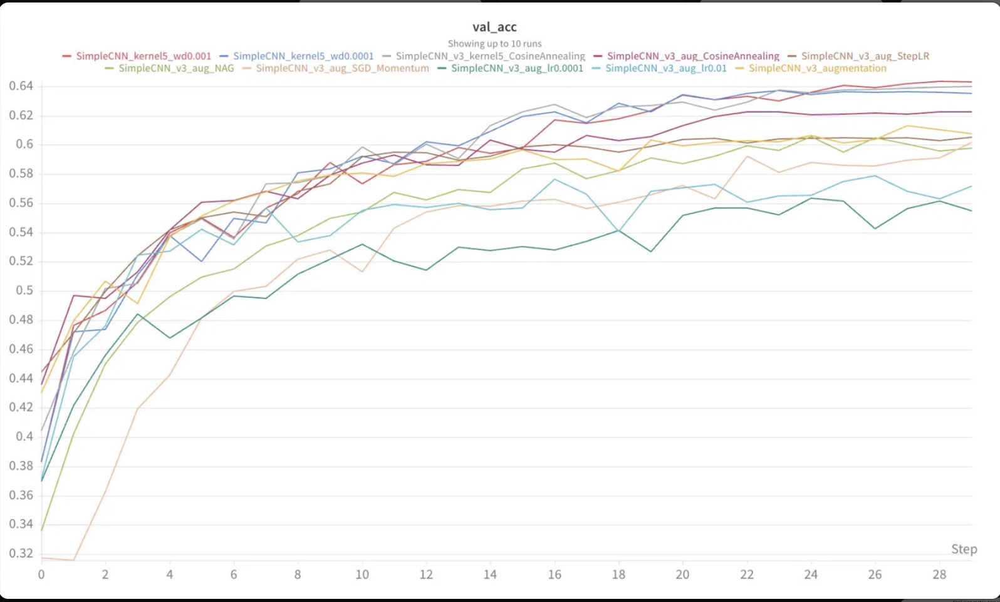


### ექსპერიმენტები და შედეგები

**CNN v1, ერთი ლეიერი:**

არქიტექტურა: Conv(32 ფილტრი, 3x3) → ReLU → MaxPool → FC → output.
Val accuracy 44.5%; train accuracy 84.2%.

ერთი conv ლეიერიც კი უკვე უკეთსია ვიდრე MLP (val 44.5% და 39.7%). მაგრამ ტრეინს და ვალს შორის 40% განსხვავება გვაჩვენებს სერიოზულ ოვერფიტს, მოდელი იზეპირებს პატერნებს.

**CNN v2, ორი ლეიერი:**

არქიტექტურა: Conv(32) → Pool → Conv(64) → Pool → FC.

Val accuracy მივიდა 53.8%-მდე მეექვსე ეპოქაში, მაგრამ შემდეგ დაიწყო კლება. მეორე ლეიერმა მისცა მოდელს საშუალება ამოეცნო feature-ების სხვდასხვა კომბინაცია, რამაც გააუმჯობესა პერფრომანსი. თუმცა ოვერფიტი კიდე უარესი გაცდა, vall loss 1.5-დან 2.47-მდე ავიდა 30 ეპოქის განმავლობაში.

**CNN v3, სამი ლეიერი, batchnorm, dropout 0.3:**

Val accuracy 56.7%, სტაბილური იყო ტრენინგის განმავლობაში. Batchnorm-ის დამატებით მნიშვნელოვნად დავასატაბილურე მოდელი. დროფაუთის დამატებით საბოლოო FC ლეიერამდე შევამცირე train/val-ს შორის სხვაობა. თუმცა მაინც ისევ ოვერფიტშია.

**Data Augmentation v3-ზე:**
val accuracy 60.8%. train accuracy 61.4%.

აქ უკვე მნიშვნელოვანი ცვლილება გვაქვს. train/val-ს შორის დიდი სხვაობა აღარ არის. გამოვიყენე random data augmentation:

- `RandomHorizontalFlip` - ამ შემთხვევაში ემოცია ისევ იგივე დარჩებოდა
- `RandomRotation(10°)` - ეს ფოტოებში ბუნებრივად ხდება
- `RandomCrop(48, padding=4)` - პატარაზე ცვლილება ხელს უწყობს, რომ მოდელი კონკრეტულ პოზიციებზე არ იყოს დამოკიდებული


ამ ცვლილებებით, მოდელი ტრენინგის დროს ფოტოებს ხედავს სხვადასხვა პოზიციებში, ორიენტაციით და ასე შემდეგ და შესაბამისად დაზეპირებას ხელს ვუშლი. ამით ვაიძულებ შეისწავლოს ნამდვილი feature-ები. ამან გააუმჯობესა ვალიდაციის accuracy დაახლოებით 4%-ით.


**Learning Rate-ების შედარება (augment v3-ზე):**

| Learning Rate | Train Acc | Val Acc |
|---|---|---|
| 0.01 | 55.1% | 57.2% |
| 0.001 | 61.4% | 60.8% |
| 0.0001 | 54.2% | 55.5% |


lr=0.001 აშკარად საუკეთესოა, lr=0.01-მა გამოიწია არასტაბილური ტრენინგი. lr=0.0001 კი ძალიან ნელია.


**Learning Rate schedulers:**

| Scheduler | Val Acc |
|---|---|
| scheduler-ის გარეშე | 60.8% |
| StepLR | 60.5% |
| CosineAnnealing | 62.3% |

CosineAnnealing საუკეთესოა. სწავლის სიჩქარის მკვეთრი ვარდნის ნაცვლად ფიქსირებულ ინტერვალებში, ის ნელა ამცირებს lr-ს კოსინუსური მრუდის მიხედვით, საწყისი მნიშვნელობიდან თითქმის ნულამდე მთელი ტრენინგის განმავლობაში. ეს ნიშნავს, რომ მოდელი მთელი სწავლების პროცესში სტაბილურად აგრძელებს პროგრესს და არ ჩერდება ყოველი დროპის შემდეგ. val accuracy ბოლო ეპოქამდე მუდმივად უმჯობესდებოდა.


**Kernel-ის ზომის შედარება:**

| Kernel-ის ზომა | Val Acc |
|---|---|
| 3x3 | 62.3% |
| 5x5 | 64.0% |


5x5 კერნელებმა მნიშვნელოვნად აჯობა 3x3-ს. სახის მახასიათებლები, როგორიცაა თვალების არე და პირი, უფრო ფართო სივრცეს მოიცავს, ვიდრე 3 პიქსელი. 5x5 კერნელი თითოეული ფილტრის გამოყენებისას უფრო მეტ, მნიშვნელოვან სივრცით კონტექსტს იჭერს.


**ოპტიმაიზერების შედარება:**

| ოპტიმაიზერი | Val Acc |
|---|---|
| Adam (lr=0.001) | 60.8% |
| SGD Momentum (lr=0.01) | 60.2% |
| NAG (lr=0.01) | 59.8% |

MLP-ისგან განსხვავებით, CNN-ში Adam-მა საუკეთესო შედეგი აჩვენა. Adam-ის ადაპტური learning rate-ები კარგად ერგება მულტილეიერიანი კონვოლუციური ქსელის უფრო რთულ loss სტრუქტურას.

**weight decay შედარება:**

| Weight Decay | Val Acc |
|---|---|
| 1e-4 | 63.5% |
| 1e-3 | 64.3% |

ორივემ გააუმჯობესა შედეგი. wd=1e-3 ოდნავ უკეთესი იყო. წონებზე დამატებული L2 რეგულარიზაცია ვალიდაციის სიზუსტეს 5x5 კერნელის საბაზისო შედეგზე მაღლა წევს.

### SimpleCNN-ის ანალიზი

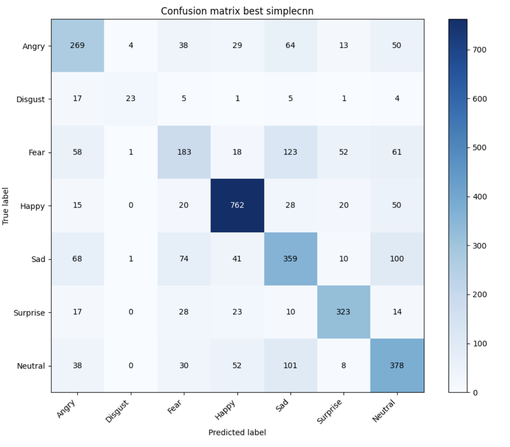
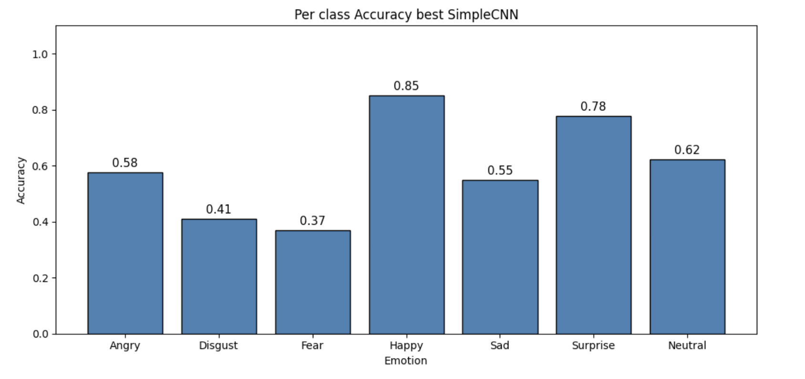

Per-class accuracy აჩვენებს, რეალურად რას აკეთებს მოდელი:

- Happy 0.85, Surprise 0.78: როგორც ვთქვით, ეს კლასები მარტივია, რადგან მათ აქვთ ძალიან გამორჩეული ვიზუალური ნიშნები
- Fear 0.37, Disgust 0.41: ეს ყველაზე რთული კლასებია. Fear ხშირად Sad-ს ჰგავს (ორივე მოიცავს შეშფოთებას), Disgust კი Angry-ს ემსგავსება (ორივე სახეზე დაძაბულობას გამოხატავს), გარდა ამისა Disgust-ს ძალიან ცოტა training მაგალითი აქვს

**საუკეთესო SimpleCNN val accuracy: 64.3%** (5x5 კერნელები, BatchNorm, Dropout 0.3, CosineAnnealing, augmentation, weight decay 1e-3)


---

## 3. Deep CNN (model_experiment_DeepCNN.ipynb)

SimpleCNN 64.3%-ზე გაიჭედა. მოდელს ჰქონდა 3 კონვოლუციური ლეიერი, რაც ნიშნავს, რომ მას შეეძლო 3 დონიანი feature hierarchy-ის სწავლა. მაგრამ სახის ემოციები მოითხოვს უფრო აბსტრაქტული კომბინაციების გაგებას, მაგალითად, როგორ ურთიერთქმედებს წარბები თვალებთან და როგორი კავშირია პირის ფორმასა და ლოყების პოზიციას შორის. უფრო მეტი ფენა საშუალებას უნდა აძლევდეს მოდელს, რომ უფრო ღრმა იერარქიები ისწავლოს.

მე გადმოვიტანე SimpleCNN-ის ყველა საუკეთესო პარამეტრი: augmentation, 5x5 საწყისი კერნელი, CosineAnnealing და weight decay. ასევე გავზარდე ეპოქები 40-მდე, რადგან SimpleCNN ჯერ კიდევ უმჯობესდებოდა 30-ე ეპოქაზე CosineAnnealing-ის დროს.

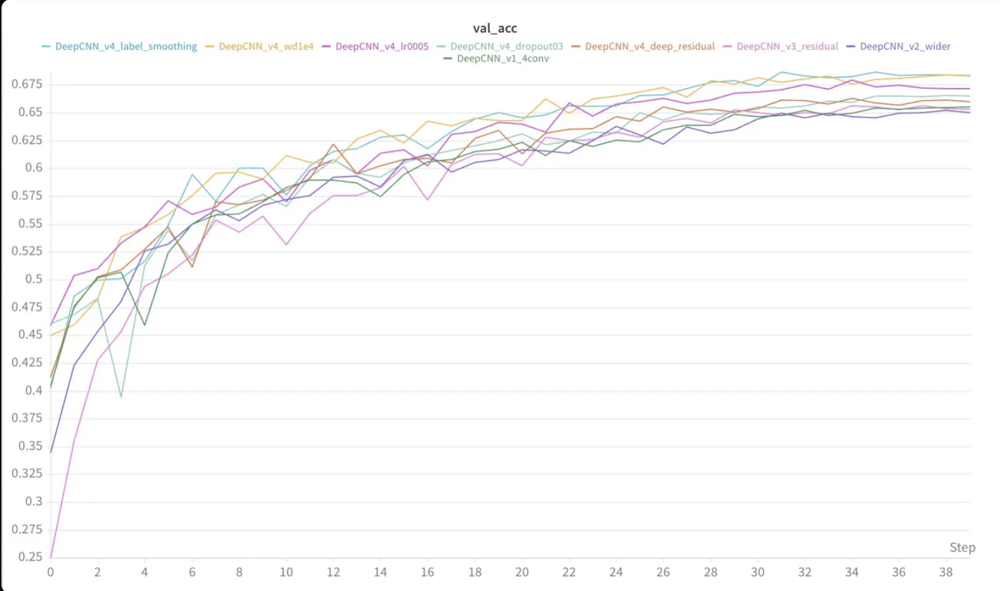


### ექსპერიმეტები და შედეგები

**DeepCNN v1. 4 Conv შრე (32->64->128->256 ფილტრები):**

Val accuracy: 65.5%. უკვე უკეთესია, ვიდრე SimpleCNN-ის 64.3%. დავამატე მეორე fully connected ფენა (512 ნეირონი output-მდე), რათა კლასიფიკატორს მეტი capacity ჰქონოდა "ღრმა" feature-ების კომბინირებისთვის.

**DeepCNN v2. Wider Filters (64->128->256->512):**

Val accuracy: 65.0%. ეს უარესია ვიდრე v1. თითოეულ ფენაში filters-ის გაორმაგებამ შედეგი არ გააუმჯობესა და ტრენინგი უფრო ნელი გახადა. bottleneck არის feature hierarchy-ის სიღრმე და არა რომელიმე კონკრეტულ დონეზე დეტექტორების რაოდენობა.

**DeepCNN v3. რეზიდუალები:**

დავამატე skip connections, სადაც output = conv_layers(x) + x. როცა ჩენელები იცვლება ფენებს შორის, 1x1 კონვოლუცია shortcut-ს შესაბამის ზომაზე აჰყავს. როცა ქსელი ღრმავდება, backpropagation-ის დროს gradient-ები შეიძლება შემცირდეს (vanish). residual connections ქმნის პირდაპირ გზას გრადიენტისთვის, რაც სიგნალს უფრო ძლიერს ინარჩუნებს.

Val accuracy: 65.3%. მსგავსია v1-ის. ამ სიღრმეზე vanishing gradients მთავარი bottleneck არ არის, თუმცა არქიტექტურა უფრო სუფთა და სტაბილურია.

**DeepCNN v4. 5 Residual Blocks + Global Average Pooling:**

ორი ძირითადი ცვლილება გავაკეთ. პირველ რიგში, მეტი residual block სიღრმის გასაზრდელად. ასევე Global Average Pooling flattening-ის ნაცვლად. GAP თითოეულ feature map-ს ასაშუალოებს და ერთ რიცხვად აქცევს.

Val accuracy: 66.0%.


**ჰიპერპარამეტრების ტუნინგი. v4:**


| კონფიგურაცია | Train Acc | Val Acc |
|---|---|---|
| v4 baseline (dropout=0.5, wd=1e-3) | 73.0% | 66.0% |
| Dropout 0.3 | 73.4% | 66.5% |
| LR = 0.0005 | 77.5% | 67.2% |
| Weight decay 1e-4 | 81.0% | 68.3% |
| Label smoothing 0.1 | 81.0% | 68.3% |

დაბალი weight decay (1e-4 vs 1e-3) ყველაზე დიდ სხვაობას იძლეოდა: 68.3% vs 66.0%. ზედმეტად ძლიერი weight decay ხელს უშლიდა მოდელს, რომ training მონაცემებზე მაქსიმალურად კარგად მორგებოდა. მოდელს სჭირდება გარკვეული თავისუფლება, რათა რთული რეპრეზენტაციები ისწავლოს.

Label smoothing იგივე შედეგს იძლეოდა, რაც weight decay.

### DeepCNN ანალიზი

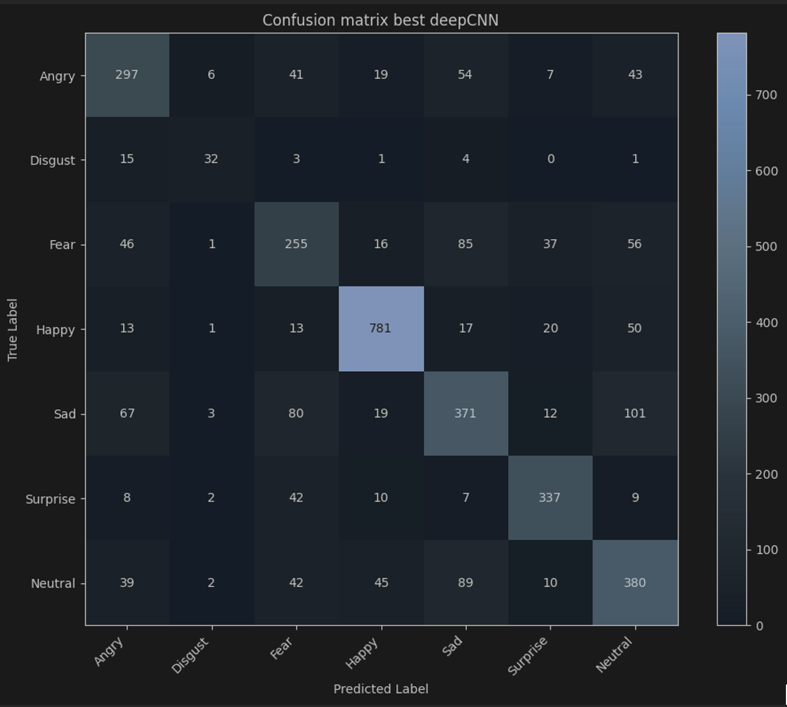
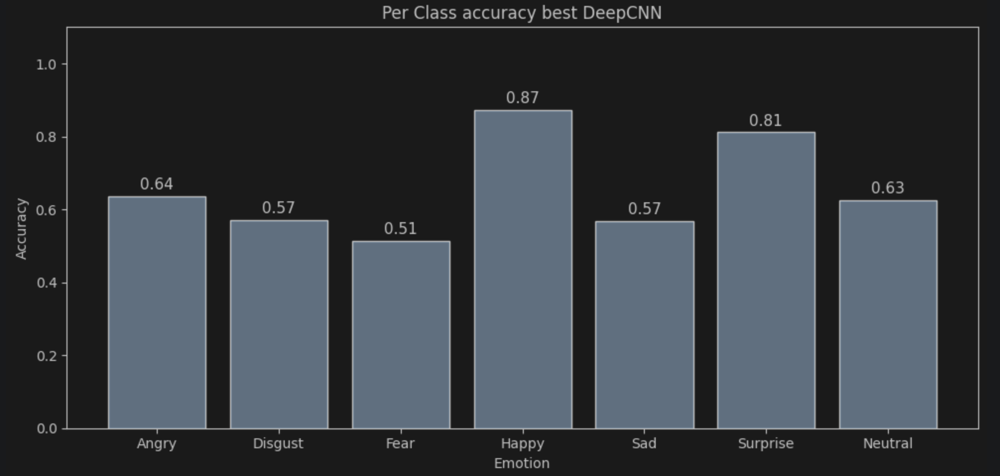


SimpleCNN-ს თუ შევადარებთ, ყველა კატეგორია გაუმჯობესდა:

| კტეგორია | SimpleCNN | DeepCNN |
|---|---|---|
| Angry | 0.58 | 0.64 |
| Disgust | 0.41 | 0.57 |
| Fear | 0.37 | 0.51 |
| Happy | 0.85 | 0.87 |
| Sad | 0.55 | 0.57 |
| Surprise | 0.78 | 0.81 |
| Neutral | 0.62 | 0.63 |


Fear გაუმჯობესდა ყველაზე მეტად.

**საუკეთესო DeepCNN val accuracy: 68.3%** (v4 deep residual + GAP, dropout=0.4, wd=1e-4, CosineAnnealing, augmentation)


---


## 4.  ResNet (model_experiment_ResNet.ipynb)

ჩვენს DeepCNN residual blocks-ში input და output channels უნდა ყოფილიყო ერთნაირი. ეს ზღუდავს მოქნილობას, რადგან ვერ ცვლი channel-ის რაოდენობას ბლოკებს შორის. ResNet ამას აგვარებს learnable shortcut-ით: როცა ჩენელის განზომილება იცვლება, shortcut-ზე გამოიყენება 1x1 convolution, რომელიც მას შესაბამის ზომაზე გარდაქმნის. ეს საშუალებას იძლევა სუფთა downsampling-ის გაკეთების conv ფენებში stride=2-ის გამოყენებით, MaxPool-ის ცალკე ოპერაციის გარეშე. შედეგად, მთელი არქიტექტურა ხდება უფრო მოქნილი.

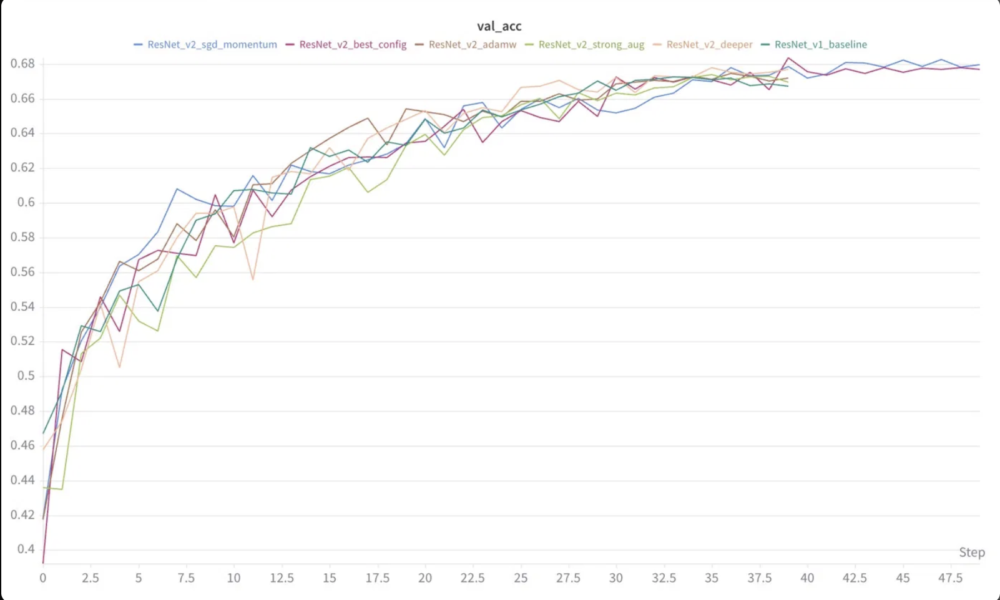


### ექსპერიმენტები და შედეგები

**ResNet v1. 4 Layers, ერთი ბლოკი თითოეული:**

თითოეულ ფენას აქვს ერთი residual block, learnable shortcut-ებით. Val acc: 66.7%. უკვე კონკურენტულია, მაგრამ თითო ფენაში მხოლოდ ერთი ბლოკი ზღუდავს იმ სირთულეს, რაც თითოეულ რეზოლუციის დონეზე შეიძლება ისწავლოს.


**ResNet v1. 4 Layers, ორი ბლოკი თითოეული:**

მეორე residual block-ის დამატება თითო ფენაში აორმაგებს სიღრმეს თითოეულ სივრცით რეზოლუციაზე. ეს ნიშნავს, რომ მოდელს შეუძლია უფრო რთული ტრანსფორმაციების სწავლა downsampling-მდე. 
Val accuracy: 67.7%.

**ResNet v2 + RandomErasing:**

დავამატე RandomErasing augmentation, რომელიც რედომად ფარავს მართკუთხა რეგიონებს და სიმულაციას უკეთებს ისეთ რაღაცებს, როგორიცაა მაგალითად ხელით სახის ნაწილობრივ დაფარვა. Val accuracy: 66.9%. augmentation ზედმეტად აგრესიული აღმოჩნდა და training სურათები ძალიან დეგრადირებული გახდა, რის გამოც მოდელს უჭირდა საკმარისი სიგნალის ამოღება. მოდელმა ისწავლა მძიმე ოკლუზიასთან(occlusion) გამკლავება, მაგრამ ამის ფასად ნაკლებად კარგად სწავლობდა ნორმალურ სახის მახასიათებლებს.

**ResNet v2 + AdamW (wd=1e-2):**

AdamW არის Adam-ის გაუმჯობესებული ვერსია, სადაც weight decay პირდაპირ წონებზე გამოიყენება და არა gradient-ის მეშვეობით. Val accuracy: 67.2%. მაღალი weight decay (1e-2) ზედმეტად მკაცრი აღმოჩნდა.

**ResNet v2. საუკეთესო (Adam, wd=1e-4, label smoothing, 50 ეპოქა):**

საუკეთესო val accuracy: 68.4%  მე-40 ეპოქაში. 50 ეპოქამდე გავზრადე, რადგან მოდელი ჯერ კიდევ უმჯობესდებოდა 40-ზე. 

**ResNet v2 + SGD Momentum (lr=0.01, 50 ეპოქა):**

ეს არის ResNet ფეიფერის ორიგინალი ტრენინგის სეთაფი. Val accuracy: 68.2%. ძალიან ახლოსაა Adam-თან. SGD momentum=0.9-ით უფრო ნელა სწავლობს, მაგრამ საბოლოოდ მსგავს შედეგს აღწევს.

### ResNet-ის ანალიზი

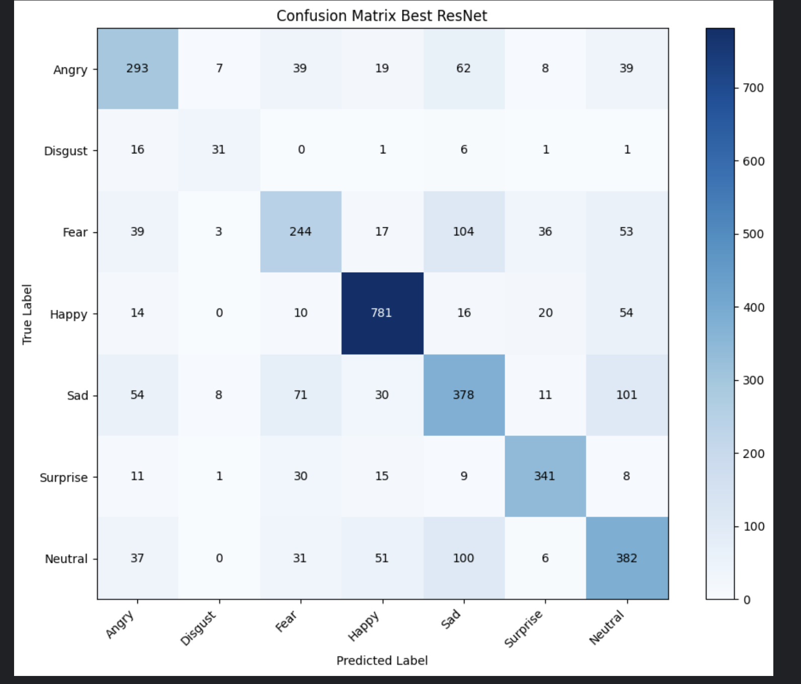
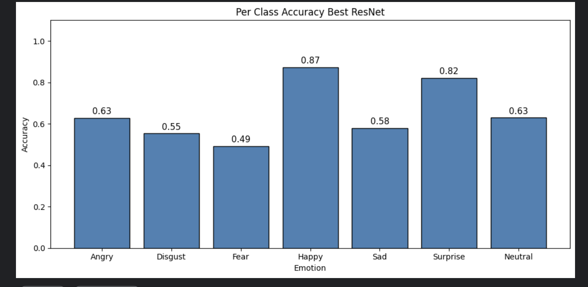


| კატეგორია | SimpleCNN | DeepCNN | ResNet |
|---|---|---|---|
| Angry | 0.58 | 0.64 | 0.63 |
| Disgust | 0.41 | 0.57 | 0.55 |
| Fear | 0.37 | 0.51 | 0.49 |
| Happy | 0.85 | 0.87 | 0.87 |
| Sad | 0.55 | 0.57 | 0.58 |
| Surprise | 0.78 | 0.81 | 0.82 |
| Neutral | 0.62 | 0.63 | 0.63 |


ResNet და DeepCNN პრაქტიკულად ერთნაირად მუშაობენ. ResNet ოდნავ უკეთესია Surprise და Sad კლასებზე, ხოლო DeepCNN ოდნავ უკეთესია Disgust და Fear კლასებზე. ეს განსხვავება ძირითადად noise-ის ფარგლებშია ორივე არქიტექტურა დაახლოებით 68%-ზეა გაჩერებული, რაც უფრო გამოწვეულია ამოცანის თანდაყოლილი სირთულით და dataset-ის ზომით, ვიდრე არქიტექტურული შეზღუდვებით.


**საუკეთესო ResNet val accuracy: 68.4%** (v2, Adam, wd=1e-4, label smoothing, 50 ეპოქა


---

## 5. GoogLeNet (model_experiment_GoogLeNet.ipynb)

ჩვენი წინა არქიტექტურები ერთ kernel size-ს ირჩევდნენ (3x3 ან 5x5). GoogLeNet-ის მთავარი ინოვაცია არის Inception module. ერთი kernel size-ის არჩევის ნაცვლად, ერთსა და იმავე input-ზე პარალელურად ვატარებთ 1x1, 3x3 და 5x5 კონვოლუციებს და შემდეგ ვაერთიანებთ შედეგებს. იდეა ისაა, რომ სხვადასხვა ტიპის მახასიათებლები სხვადასხვა მასშტაბზე უნდა დაიჭიროს ერთდროულად. მაგალითად, თვალები შეიძლება კარგად აღიწეროს 3x3-ით, ხოლო სახის უფრო ფართო რეგიონებს 5x5 უკეთ იჭერს. 1x1 კონვოლუციები კი უფრო დიდი branches-ის წინ ამცირებს ჩენელის განზომილებებს იაფად, რაც ხარჯს მართვადს ხდის.

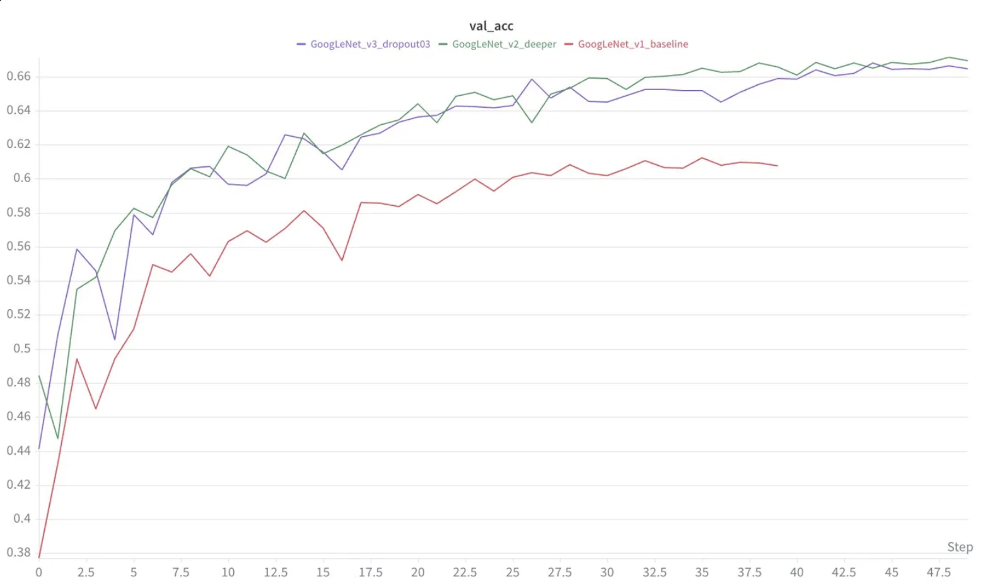


### ექსპერიმენტები და შედეგები


**GoogLeNet v1. 3 Inception მოდული (პატარა ჩენელები):**

Val accuracy: 60.7%, ხოლო training accuracy მხოლოდ 62.4%. ორივე ხაზი ახლოსაა და დაბალია, რაც ანდერფიტზე მიგვანიშნებს. Inception modules-ს ძალიან ცოტა ჩენელი ჰქონდა, რის გამოც საკმარისი რეპრეზენტაციების სწავლა ვერ ხდებოდა. 

ეს საინტერესო ანდერფიტის შემთხვევაა. როგორ წესი, ოვერფიტზე ვნერვიულობთ, მაგრამ აქ მოდელი ოვერფიტში ვერ გადავარდა, რადგან ტრანინგ დატის სწავლაც კი ვერ მოახერხა წესიერად.


**GoogLeNet v2. 4 Inception მოდული, უფრო ფართო (50 ეპოქა):**

Channel size გაიზარდა და დაემატა მეოთხე Inception მოდული. Val acc გაიზარდა 66.9%-მდე. მოდელს მეტი capacity სჭირდებოდა. თითოეულ პარალელურ branch-ს სჭირდება საკმარისი ფილტრები, რომ სხვადასხვა ტიპის features-ზე სპეციალიზდეს.

**GoogLeNet v3. Dropout 0.3:**

Val acc: 66.5%. ოდნავ უარესია ვიდრე v2 (dropout 0.4). ნაკლები ფილტრების მქონე მოდელი უკეთესად მუშაობს მსუბუქ რეგულარიზაციაზე, თუმცა განსხვავება მინიმალურია.

### GoogLeNet ანალიზი

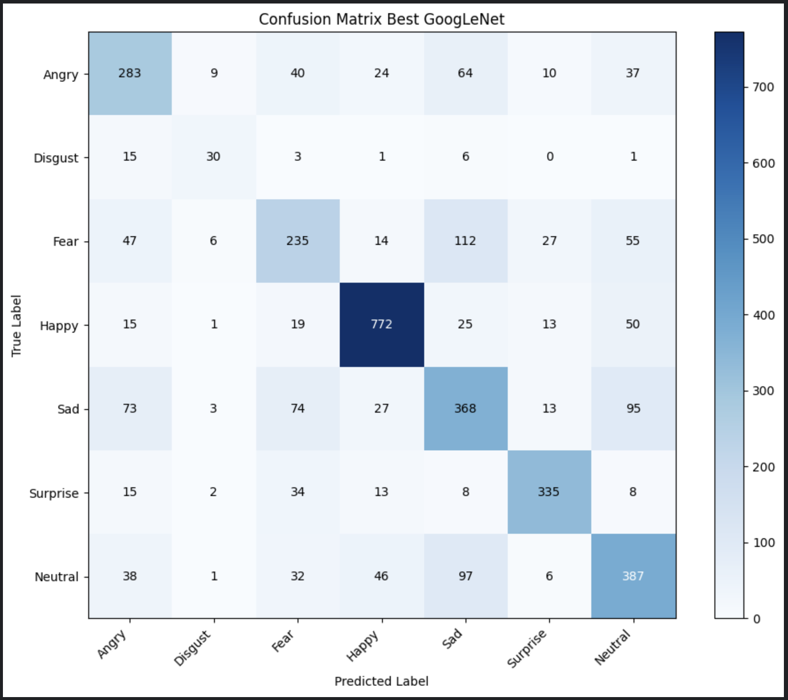
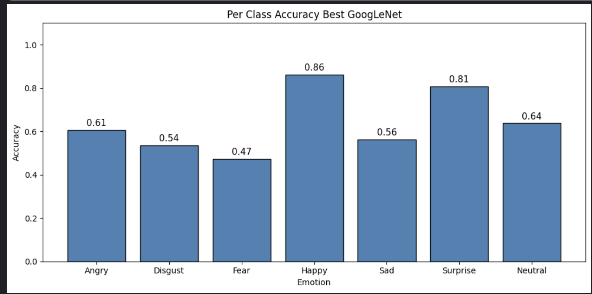


GoogLeNet (66.9%) ჩამორჩა როგორც DeepCNN-ს (68.3%), ისე ResNet-ს (68.4%). ეს საინტერესო შედეგია. Inception მოდულები თეორიულად ძალიან ძლიერია. multi-scale feature-ების ერთდროულად დაჭერა უნდა ეხმარებოდეს ისეთ ამოცანებს, როგორიცაა სახის ემოციები, სადაც მნიშვნელოვანი სტრუქტურები სხვადასხვა ზომისაა. მაგრამ პრაქტიკაში, მხოლოდ 28709 ტრენინგ სურათით, მოდელს არ აქვს საკმარისი მონაცემი, რომ ისწავლოს თითოეული პარალელური ბრენჩი რაში უნდა სპეციალიზდეს. 

**საუკეთესო GoogleNet val accuracy: 66.9%** (v2 4 inception მოდულით, dropout=0.4, wd=1e-4)

---

## შედები და არქიტექტურების შედარება


| არქიტექტურა | საუკეთესო Val Accuracy | Train Accuracy | ეპოქები | 
|---|---|---|---|
| MLP | 45.4% | 75.5% | 30 | 
| SimpleCNN | 64.3% | ~62% | 30 | 
| DeepCNN | 68.3% | 81.0% | 40 |
| ResNet | 68.4% | 82.5% | 50 | 
| GoogLeNet | 66.9% | 78.3% | 50 | 


### Per class accuracy ყველა არქიტექტურაში

| კატეგორია | MLP | SimpleCNN | DeepCNN | ResNet | GoogLeNet |
|---|---|---|---|---|---|
| Angry | — | 0.58 | 0.64 | 0.63 | 0.61 |
| Disgust | — | 0.41 | 0.57 | 0.55 | 0.54 |
| Fear | — | 0.37 | 0.51 | 0.49 | 0.47 |
| Happy | — | 0.85 | 0.87 | 0.87 | 0.86 |
| Sad | — | 0.55 | 0.57 | 0.58 | 0.56 |
| Surprise | — | 0.78 | 0.81 | 0.82 | 0.81 |
| Neutral | — | 0.62 | 0.63 | 0.63 | 0.64 |


Fear და Disgust ყველა არქიტექტურაში ყველაზე რთულ კლასებად რჩება. Fear-ის მაქსიმუმი არის 0.51 (DeepCNN-ში), ხოლო Disgust-ის 0.57 (DeepCNN-ში). ეს შედეგები ორ განსხვავებულ პრობლემას ასახავს: Fear ვიზუალურად რთული გასარჩევია (ხშირად ჰგავს Sad-ს და Angry-ს), ხოლო Disgust ნაკლებად არის წარმოდგენილი dataset-ში.


---

## საბოლოო მოდელის შერჩევა, inference (model_inference.ipynb)

მე საბოლოო მოდელად ავირჩიე **DeepCNN v4 არქიტექტრა**. მიუხედავად იმისა, რომ ResNet-მა ოდნავ მაღალი peak შედეგი აჩვენა ეპოქა 40-ზე (68.4% vs 68.3%), ეს განსხვავება noise-ის ფარგლებშია და DeepCNN არქიტექტურულად უფრო სუფთაა. გადაწყვეტილება მივიღე შედეგების სტაბილურობის მიხედვით და არა ერთი კონკრეტული საუკეთესო რიცხვის მიხედვით.

საბოლოო მოდელი თავიდან დავატრენინგე model_inference.ipynb-ში ზუსტად იგივე საუკეთესო კონფიგურაციით:

- 4 convolutional stage პროგრესული filter depth-ით (64->128->256->512)
- 5 residual ბლოკი
- Global Average Pooling
- Dropout 0.4
- Adam, lr=0.001, weight decay 1e-4
- CosineAnnealing 40 ეპოქაზე
- Label smoothing 0.1
- სრული data augmentation


**საბოლოო validation accuracy: 67.99%**


დატრენინგებული მოდელის წონები შენახულია W&B Artifact-ში (best_model_fer). Test predictions შენაცულია submission.csv-ში.


## W&B Tracking

**W&B პროექტი:** https://wandb.ai/gdzag22-free-university-of-tbilisi-/facial_expression_recognition

დალოგილია შემდეგი მეტრიკები თითოეულ run-ზე:

- `train_loss` 
- `val_loss` 
- `train_acc`
- `val_acc`
- `lr`


**საუკეთესო მოდელი: DeepCNN v4. 4 conv stages (64->128->256->512), 5 რეზიდუალ ბლოკი, GAP, Dropout 0.4, Adam lr=0.001, wd=1e-4, CosineAnnealing, Label Smoothing 0.1, 40 ეპოქა, Train: 81.0%, Val: 67.99%**


# BONUS REPORT

https://wandb.ai/gdzag22-free-university-of-tbilisi-/facial_expression_recognition/reports/Facial-Expression-Recognition-Experiment-Report--VmlldzoxNzI1MDYzMw